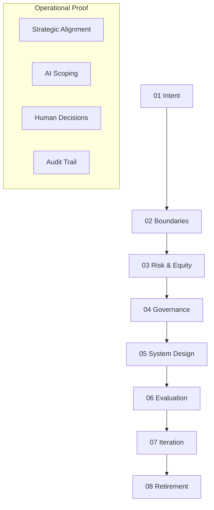

# Capability-Driven Development: Method Overview

_Status: Draft_

---

## Purpose of the Method

This document provides an overview of the **Capability-Driven Development (CDD)** method.

CDD is a structured design approach for building AI-enabled software systems in ways that preserve and strengthen human, organisational, and institutional capability.

The method exists to ensure that:
- capability requirements are articulated before automation decisions
- human judgement is designed into systems, not added retrospectively
- governance and accountability are treated as design constraints
- systems remain defensible as technologies and contexts change

This overview explains the **logic, sequencing, and intent** of the method before introducing the individual steps in detail.

---

## When to Use Capability-Driven Development

CDD should be used when:

- designing or building AI-enabled software systems
- introducing automation into decision-adjacent workflows
- developing systems that affect learning, research, governance, or public-interest functions
- translating capability principles into operational system behaviour

CDD is **not** required for:
- general AI literacy or training
- capability assessment alone
- policy development without system design
- purely conceptual exploration

The method is explicitly oriented toward **applied system design**.

---

## Core Design Assumptions

Capability-Driven Development rests on a small number of explicit assumptions:

1. **Capability precedes technology**  
   Systems should be designed around capability requirements, not tool affordances.

2. **Judgement cannot be automated away**  
   Human judgement remains central, even when AI systems assist or mediate decisions.

3. **Governance is a design problem**  
   Accountability, traceability, and oversight must be embedded into systems, not bolted on.

4. **Change is inevitable**  
   Systems must be designed for iteration, review, and eventual retirement.

These assumptions inform both the order and content of the method steps.

## The CDD Lifecycle

## System Mapping: Theory to Execution

Capability-Driven Development stages map directly to the CloudPedagogy ecosystem layers and tools:

| CDD Phase | System Layer | Primary Tooling |
|:---|:---|:---|
| **01 Intent** | Concept | Course Engine (.yml), Capability Studio |
| **02 Boundaries** | Logic | Human-AI Decision Record |
| **03 Risk & Equity** | Ethics | Risk Scanner, Alignment Engine |
| **04 Governance** | Oversight | Programme Governance Dashboard |
| **05 System Design** | Infrastructure | Shared Module Repository, Integration SDK |
| **06 Evaluation** | Feedback | Capability Assessment Tool |
| **07 Iteration** | Evolution | Curriculum Refactoring Tool |
| **08 Retirement** | Lifecycle | Shared Module Repository (Deprecation) |

---

Capability-Driven Development follows a deliberate, ordered sequence.

Each step builds on the previous one and constrains the next.

1. **Capability intent**  
   Define the human and institutional capabilities the system must support and protect.

2. **Human–AI boundaries**  
   Specify where AI assists, where humans decide, and how escalation and override occur.

3. **Ethics, equity, and risk**  
   Identify foreseeable harms, exclusions, misuse, and unintended consequences.

4. **Governance and oversight**  
   Design accountability, traceability, review, and contestability into the system.

5. **System design and architecture**  
   Select system structures and implementation patterns that respect earlier constraints.

6. **Evaluation and monitoring**  
   Define how system behaviour will be reviewed, audited, and assessed over time.

7. **Iteration and change**  
   Plan for adaptation as contexts, expectations, and technologies evolve.

8. **Retirement and deprecation**  
   Design for graceful withdrawal, replacement, or shutdown where appropriate.

This sequence is explained in detail across the remaining files in this directory.

---

## Why Order Matters

The CDD method is intentionally ordered.

Common failures in AI-enabled system design arise when:

- automation decisions precede capability intent
- technical architectures constrain governance options
- ethical considerations are addressed after deployment
- evaluation is treated as an afterthought

CDD reverses these patterns by ensuring that:
- early decisions constrain later ones
- governance requirements shape system architecture
- human roles are explicit from the outset

Reordering steps undermines the method.

---

## Relationship to the AI Capability Framework

The CDD method assumes the use of the **CloudPedagogy AI Capability Framework** to define capability priorities and values.

The Framework:
- defines *what* responsible AI capability is

CDD:
- defines *how* to design systems that embody that capability

CDD does not restate or reinterpret the Framework.  
It applies it procedurally.

---

## How the Method Is Intended to Be Used

The CDD method is designed to be used:

- iteratively rather than linearly
- collaboratively rather than individually
- as a design aid, not a compliance checklist

In practice, teams may revisit earlier steps as:
- new risks emerge
- contexts change
- system behaviour is observed

However, the **initial sequencing remains important** for first-pass design.

---

## Supporting Materials

The following materials support application of the method:

- **Design artifacts** (`/design-artifacts`)  
  Templates for documenting capability-led design decisions.

- **Patterns** (`/patterns`)  
  Reusable system design patterns aligned to capability requirements.

- **Examples** (`/examples`)  
  Illustrative applications of the method in practice.

- **AI-assisted reflection** (`/ai-assisted-reflection`)  
  Optional prompts to support human sense-making during design.

---

## Next Steps

To apply Capability-Driven Development in detail, continue with:

- `01-capability-intent.md`
- `02-human-ai-boundaries.md`
- `03-ethics-equity-risk.md`

Each file expands a single step of the method and introduces design questions rather than prescriptions.

---

## Summary

Capability-Driven Development provides a disciplined way to ensure that AI-enabled systems:

- strengthen rather than erode human capability
- remain governable and accountable
- evolve responsibly over time

It is not a shortcut to automation, but a guardrail for responsible system design.

